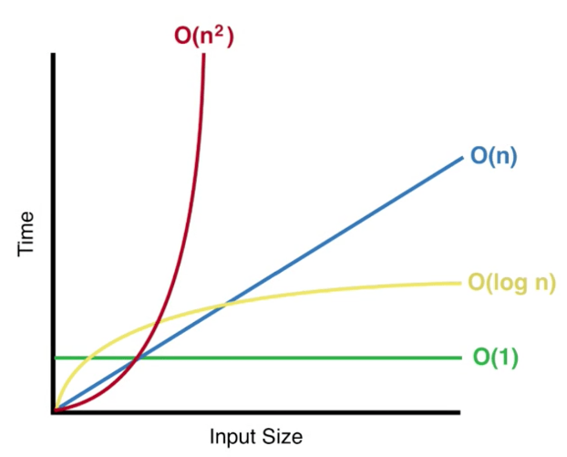

# algorithms_python
<HTML>
<body>
  <h1><ins>Binary Search</ins></h1>

<pre>
<code>
def binarySearch(numbers, low, high, x):
    if (high >= low):
        mid = low + (high - low)//2
        if (numbers[mid] == x):
            return mid
        elif (numbers[mid] > x):
            return binarySearch(numbers, low, mid-1, x)
        else:
            return binarySearch(numbers, mid+1, high, x)
    else:
        return -1
numbers = [ 1,4,6,7,12,17,25 ]   #binary search requires sorted numbers
x = 7
result = binarySearch(numbers, 0, len(numbers)-1, x)
if (result != -1):
    print("Search successful, element found at position ", result)
else:
    print("The given element is not present in the array")
</code>
</pre>

</body>
</HTML>
